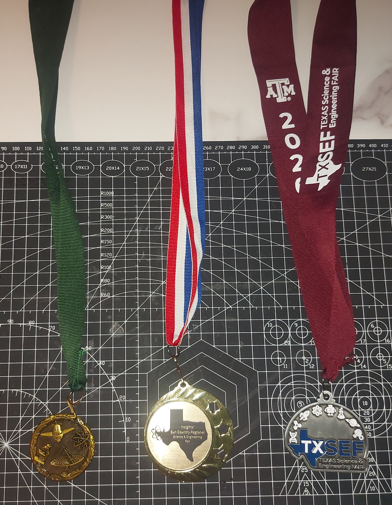
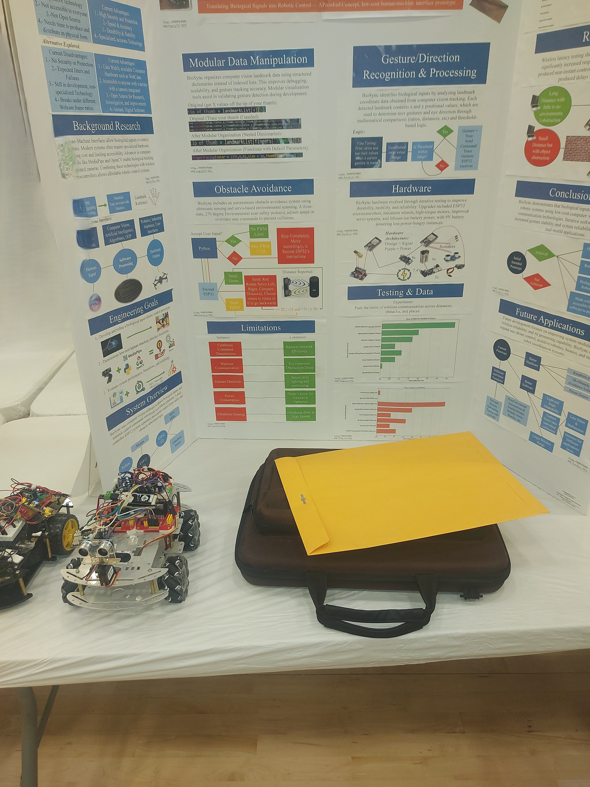

# Vision 🎯

Translating Biological Inputs into Robotic outputs | A solution to expensive Biometric software for human-machine interfaces

# Demo 
Video on Youtube: [View Here](https://www.youtube.com/watch?v=du2PsQilVY8)

# Abstract 📝

BioSync is a project that started on October 29, 2025. This, being my first time interacting with Electronics, mostly Arduino-related software and hardware, the goal being to develop a program capable of turning Biological inputs (such as hand gestures, gaze with iris, and facial expression) to robotic outputs (an RC car) using consumer hardware such as a camera. This project has come a long way, and officially came to an end on March 29, 2026. These 5 months of restless work and iteration have laid the foundations for my knowledge in Robotics, and greatly improved my programming and critical-thinking skills, a project that I'm proud of.

# Awards🥇🏆

BioSync was developed during my freshman year, where I presented it at my school fair, winning first place in the category of Robotics & Intelligent Machines, where I soon got moved to participate at the Sun Country Regional Fair (El Paso) where I competed against all public,private,and charter school districts in El Paso in my category, also winning first place in Robotics & Intelligent Machines, this, led me to participate at the Texas Science & Engineering Fair (TX-SEF).

# Documentation 🤔❓

Unfortunetely, Biosync was developed far before I took the grasp of Github, and, therefore, lacks complete code history, although, there are different sources to take a closer look at my project, some of these sources are a Powerpoint presentation, a virtual display board, the source code (which contains comments and Doc strings), and this ReadMe, all sources can be found at the very bottom of the ReadMe.

# Frameworks Used and Materials ⚙️🔧

To achieve hand detection, iris tracking, and facial expression classification, I decided to use Python as my base programming language, along with two libraries: Mediapipe & OpenCV. For the RC car, I used the Arduino IDE to program both ESP32’s and a basic chassis with wheels for movement.

# Gesture/Gaze/Facial Classification and Detection 👁️

BioSync, as previously mentioned, uses OpenCV and Mediapipe, OpenCV acts as the ‘camera’ where it takes multiple pictures per second, called frames, MediaPipe in this case tracks the different landmarks, whether it is your hand(hand.mesh_cords) or face(face.mesh_cords), the landmarks give specific positions (x and y) which we can use to classify different gestures, for this, we use distances & ratios, for example:
Let’s say you want to detect when someone is looking left, you can compare the distance between the left corner of your eyeball and the iris, if the distance decreases below a threshold, that means the person is looking left, although, this presents a problem, if you move far from the camera or closer, those readings become unstable, therefore I implemented ratios, which means we compare two distances (such as the distance from the right corner of your eyeball to the iris) by dividing the distance we want to track by the one we’re comparing to, since, as one increases, the other one does too, as one decreases so does the other, giving us stable readings we can use to hardcode different gestures and classify them.

# Robotic Output 🤖

The RC car uses a dual-controller system, with two ESP32’s, the first ESP32 is responsible for recieving Python commands and controlling the Driver Modules for the motors, the second ESP32 handles the Obstacle Avoidance logic, which, based on the readings from the Ultrasonic sensor, will send different commands to the first ESP32, Red, Yellow, or Green, Green means Python (the user) can send commands freely and go at maximum speed, Yellow means the user can still send commands (such as going forward with a thumbs up) but with a speed limit (75/255 max) and finally, the red command blocks the user from sending commands, this, so it doesn’t interfiere with the red protocol, which involves performing a 270 degree enviormental scan where the ultrasonic sensor, mounted on a servo, will check both ways and decide where to go by comparing the distances, for example, if the distance on the left is greater than the distance on the right, the car will rotate left, if both distances are less than a certain threshold (such as a narrow space), the car will go backwards instead.

# Example of Usage and other Hardware Comparison 💰

If you’re paralyzed on a hospital bed, a cheap camera with the open-source software could easily track your eye movement using computer vision, which could translate those gestures into commands (e.g: Looking right for more than 5 seconds = Need assitance) this is what BioSync demonstrates, you do not need the most expensive Biometric hardware out there to achieve gesture or gaze recognition, since the software can run from any camera, for instancce, the Irisbond Hiru, which is a lightweight eye tracker designed for similar tasks, costs 3,463 USD dollars compared to Biosync, which is free. (https://www.bridges-canada.com/products/irisbond-hiru-eye-tracker)

# What I learned 🧠

This project, as mentioned previously, introduced me to Arduino, which means it was my first time manipulating electronics such as breadboards, jumper wires, soldering, LEDs, sensors, servos, and of course, the Arduino IDE, which uses C++ syntax. I had some Python experience beforehand, but, for the development of this project’s software, I had to force myself to learn OOP, 2D lists and dictionaries, Error handling, and practice solutions that came after hours of trial-and-error.

# More Documentation Sources ➕

PowerPoint Presentation: [View Here](C:\Users\Admin\OneDrive\Documents\Slide_show_presentation.pptx)
The rest, such as the virtual trifold, are part of this repository’s files.

# Bibliography ❤️

One of the main mentors in achieving the software for this project was freeCodeCamp’s “Advanced Computer Vision with Python - Full Course,” which laid the fundation for my understanding on mediapipe and openCV.
[View Here](https://youtu.be/01sAkU_NvOY)

